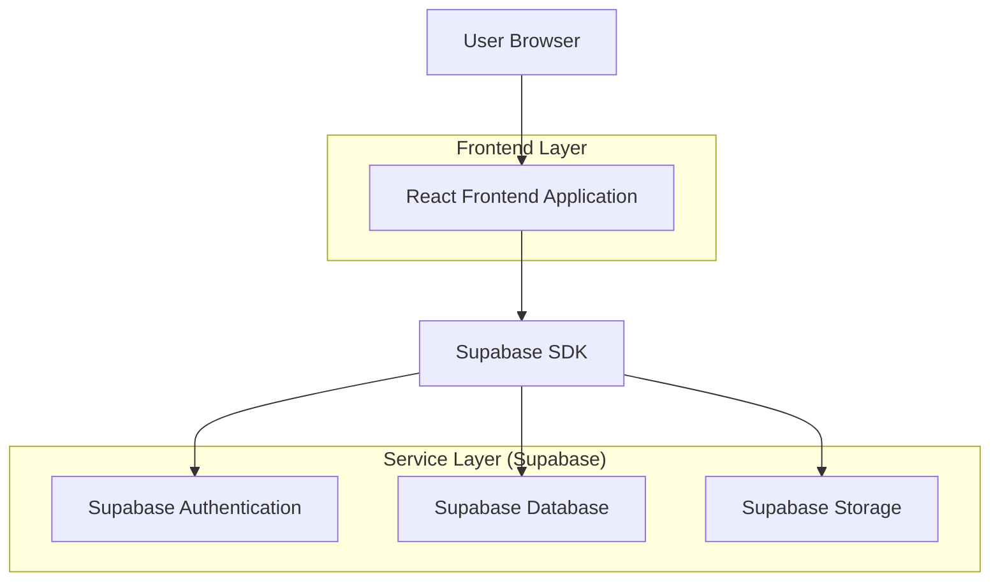
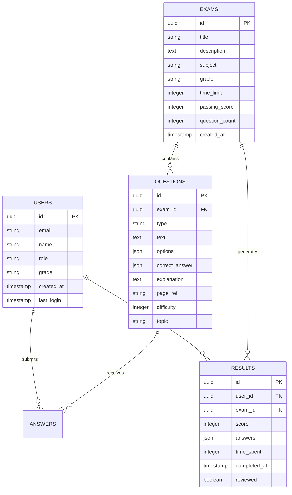

## 1. Architecture design



## 2. Technology Description
- Frontend: React@18 + tailwindcss@3 + vite
- Initialization Tool: vite-init
- Backend: Supabase (BaaS)
- Database: PostgreSQL (via Supabase)
- Authentication: Supabase Auth
- Styling: Tailwind CSS with RTL support
- State Management: React Context + useState
- Icons: Lucide React
- Animations: Framer Motion

## 3. Route definitions
| Route | Purpose |
|-------|---------|
| / | Homepage with exam selection and statistics |
| /exam/:id | Interactive exam interface with questions |
| /results/:examId | Detailed results with explanations |
| /analytics | Performance analytics and progress tracking |
| /login | User authentication page |
| /profile | User profile and settings |
| /admin | Admin dashboard for teachers |

## 4. Core Components

### 4.1 Frontend Components
```typescript
// Main App Component
interface AppProps {
  user: User | null;
  loading: boolean;
}

// Exam Card Component
interface ExamCardProps {
  id: string;
  title: string;
  questionCount: number;
  timeLimit: number;
  difficulty: 'easy' | 'medium' | 'hard';
  completed?: boolean;
  score?: number;
}

// Question Component
interface QuestionProps {
  id: string;
  type: 'mcq' | 'truefalse' | 'essay';
  text: string;
  options?: string[];
  correctAnswer: number | boolean | string;
  explanation: string;
  pageRef: string;
  onAnswer: (answer: any) => void;
  userAnswer?: any;
}

// Results Component
interface ResultsProps {
  examId: string;
  score: number;
  totalQuestions: number;
  answers: Record<string, any>;
  explanations: Record<string, string>;
  onRetake: () => void;
  onReview: () => void;
}
```

### 4.2 Data Models

```typescript
// User Interface
interface User {
  id: string;
  email: string;
  name: string;
  role: 'student' | 'teacher';
  grade: string;
  createdAt: Date;
  lastLogin: Date;
}

// Exam Interface
interface Exam {
  id: string;
  title: string;
  description: string;
  subject: string;
  grade: string;
  questions: Question[];
  timeLimit: number;
  passingScore: number;
  createdAt: Date;
}

// Question Interface
interface Question {
  id: string;
  examId: string;
  type: 'mcq' | 'truefalse' | 'essay' | 'matching';
  text: string;
  options?: string[];
  correctAnswer: number | boolean | string | number[][];
  explanation: string;
  pageRef: string;
  difficulty: number;
  topic: string;
}

// Result Interface
interface Result {
  id: string;
  userId: string;
  examId: string;
  score: number;
  answers: Record<string, any>;
  timeSpent: number;
  completedAt: Date;
  reviewed: boolean;
}
```

## 5. Database Schema

### 5.1 Tables Structure


### 5.2 Data Definition Language
```sql
-- Users table
CREATE TABLE users (
    id UUID PRIMARY KEY DEFAULT gen_random_uuid(),
    email VARCHAR(255) UNIQUE NOT NULL,
    name VARCHAR(100) NOT NULL,
    role VARCHAR(20) DEFAULT 'student' CHECK (role IN ('student', 'teacher')),
    grade VARCHAR(10),
    created_at TIMESTAMP WITH TIME ZONE DEFAULT NOW(),
    last_login TIMESTAMP WITH TIME ZONE DEFAULT NOW()
);

-- Exams table
CREATE TABLE exams (
    id UUID PRIMARY KEY DEFAULT gen_random_uuid(),
    title VARCHAR(255) NOT NULL,
    description TEXT,
    subject VARCHAR(50) NOT NULL,
    grade VARCHAR(10) NOT NULL,
    time_limit INTEGER NOT NULL,
    passing_score INTEGER NOT NULL,
    question_count INTEGER NOT NULL,
    created_at TIMESTAMP WITH TIME ZONE DEFAULT NOW()
);

-- Questions table
CREATE TABLE questions (
    id UUID PRIMARY KEY DEFAULT gen_random_uuid(),
    exam_id UUID REFERENCES exams(id) ON DELETE CASCADE,
    type VARCHAR(20) NOT NULL CHECK (type IN ('mcq', 'truefalse', 'essay', 'matching')),
    text TEXT NOT NULL,
    options JSONB,
    correct_answer JSONB NOT NULL,
    explanation TEXT NOT NULL,
    page_ref VARCHAR(20),
    difficulty INTEGER CHECK (difficulty BETWEEN 1 AND 5),
    topic VARCHAR(100)
);

-- Results table
CREATE TABLE results (
    id UUID PRIMARY KEY DEFAULT gen_random_uuid(),
    user_id UUID REFERENCES users(id) ON DELETE CASCADE,
    exam_id UUID REFERENCES exams(id) ON DELETE CASCADE,
    score INTEGER NOT NULL CHECK (score BETWEEN 0 AND 100),
    answers JSONB NOT NULL,
    time_spent INTEGER NOT NULL,
    completed_at TIMESTAMP WITH TIME ZONE DEFAULT NOW(),
    reviewed BOOLEAN DEFAULT FALSE
);

-- Indexes for performance
CREATE INDEX idx_users_email ON users(email);
CREATE INDEX idx_questions_exam_id ON questions(exam_id);
CREATE INDEX idx_results_user_id ON results(user_id);
CREATE INDEX idx_results_exam_id ON results(exam_id);
CREATE INDEX idx_results_completed_at ON results(completed_at DESC);

-- Row Level Security (RLS)
ALTER TABLE users ENABLE ROW LEVEL SECURITY;
ALTER TABLE exams ENABLE ROW LEVEL SECURITY;
ALTER TABLE questions ENABLE ROW LEVEL SECURITY;
ALTER TABLE results ENABLE ROW LEVEL SECURITY;

-- Policies for users
CREATE POLICY "Users can view own profile" ON users
    FOR SELECT USING (auth.uid() = id);

CREATE POLICY "Users can update own profile" ON users
    FOR UPDATE USING (auth.uid() = id);

-- Policies for exams (public read for students)
CREATE POLICY "Anyone can view published exams" ON exams
    FOR SELECT USING (true);

-- Policies for questions (public read for students)
CREATE POLICY "Anyone can view exam questions" ON questions
    FOR SELECT USING (true);

-- Policies for results (users can only see own results)
CREATE POLICY "Users can view own results" ON results
    FOR SELECT USING (auth.uid() = user_id);

CREATE POLICY "Users can insert own results" ON results
    FOR INSERT WITH CHECK (auth.uid() = user_id);
```

## 6. Security & Performance

### 6.1 Security Measures
- Authentication via Supabase Auth with email verification
- Row Level Security (RLS) policies on all tables
- Input validation and sanitization on frontend
- Rate limiting for API calls
- HTTPS enforcement

### 6.2 Performance Optimization
- Database indexing on frequently queried columns
- Pagination for large question sets
- Lazy loading for analytics data
- Client-side caching for exam data
- Optimistic UI updates for better UX

### 6.3 RTL Support Implementation
```css
/* Tailwind CSS RTL configuration */
@tailwind base;
@tailwind components;
@tailwind utilities;

@layer utilities {
  .rtl {
    direction: rtl;
  }
  
  .ltr {
    direction: ltr;
  }
}

/* Arabic font stack */
.font-arabic {
  font-family: 'Tajawal', 'Inter', sans-serif;
}
```

## 7. Deployment Architecture

### 7.1 Frontend Deployment
- Build optimized React application
- Deploy to Vercel/Netlify for CDN distribution
- Environment variables for Supabase configuration
- Custom domain with SSL certificate

### 7.2 Database & Backend
- Supabase hosted PostgreSQL database
- Automatic backups and point-in-time recovery
- Real-time subscriptions for live features
- Built-in authentication and user management