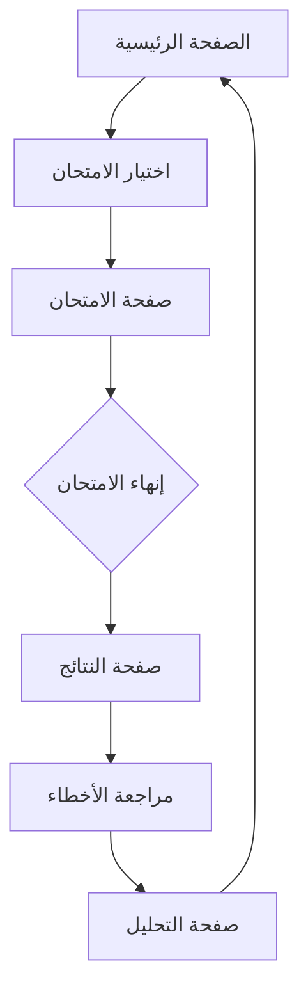

## 1. Product Overview
تطبيق ويب تعليمي متخصص في مادة الأحياء للصفوف العاشر والحادي عشر في الكويت، يحول ملفات HTML الحالية إلى نظام امتحانات تفاعلي باللغة العربية مع تقييم ذكي وشروحات مفصلة.

المشكلـة: الملفات الHTML الحالية تحتوي على أسئلة ثابتة بدون نظام تقييم أو تتبع للتقدم أو واجهة مستخدم حديثة.
الحل: تحويل المحتوى إلى تطبيق ويب متكامل مع واجهة عربية متجاوبة، نظام تقييم آلي، وشروحات تفصيلية لكل سؤال.

القيمة السوقية: أول تطبيق متخصص في الأحياء باللغة العربية للمنهج الكويتي مع تقييم ذكي وتحليل الأداء.

## 2. Core Features

### 2.1 User Roles
| Role | Registration Method | Core Permissions |
|------|---------------------|------------------|
| طالب | التسجيل بالبريد الإلكتروني | حل الامتحانات، مشاهدة النتائج، مراجعة الأخطاء |
| معلم | التسجيل برمز دعوة | إنشاء الامتحانات، متابعة أداء الطلاب، تصدير التقارير |
| زائر | بدون تسجيل | حل امتحانات محدودة، مشاهدة نتائج مبسطة |

### 2.2 Feature Module
تطبيق الامتحانات التفاعلي يتكون من الصفحات الأساسية التالية:
1. **الصفحة الرئيسية**: عرض الامتحانات المتاحة، شريط تقدم عام، إحصائيات الأداء.
2. **صفحة الامتحان**: عرض الأسئلة مع خيارات متعددة، عداد زمني، علامة مرجعية للأسئلة.
3. **صفحة النتائج**: عرض النتيجة الكلية، تحليل الأداء، مراجعة الأخطاء مع الشروحات.
4. **صفحة التحليل**: رسوم بيانية للأداء، تحديد نقاط القوة والضعف، توصيات للتحسين.

### 2.3 Page Details
| Page Name | Module Name | Feature description |
|-----------|-------------|---------------------|
| الصفحة الرئيسية | شريط التقدم | عرض نسبة الإنجاز الكلية للطالب في جميع الامتحانات |
| الصفحة الرئيسية | بطاقات الامتحانات | عرض الامتحانات المتاحة مع عدد الأسئلة والوقت المخصص |
| الصفحة الرئيسية | إحصائيات سريعة | عرض عدد الامتحانات المنجزة، معدل النجاح، وقت الدراسة |
| صفحة الامتحان | منطقة السؤال | عرض السؤال باللغة العربية مع خيارات متعددة مرتبة حسب الحروف |
| صفحة الامتحان | عداد الزمن | عرض الوقت المتبقي بصيغة MM:SS مع تحذير عند 5 دقائق |
| صفحة الامتحان | أزرار التنقل | السماح بالتنقل بين الأسئلة مع حفظ الإجابات تلقائياً |
| صفحة النتائج | بطاقة النتيجة | عرض النتيجة كنسبة مئوية مع رسالة تشجيعية حسب الأداء |
| صفحة النتائج | جدول المراجعة | عرض جميع الأسئلة مع الإجابات الصحيحة والخاطئة |
| صفحة النتائج | منطقة الشرح | عرض شرح مفصل لكل سؤال مع مرجع من الكتاب المدرسي |
| صفحة التحليل | الرسم البياني | عرض تقدم الأداء عبر الوقت مع تحديد التحسن أو التراجع |
| صفحة التحليل | تحليل المواضيع | تصنيف الأخطاء حسب الوحدات الدراسية لتحديد نقاط الضعف |
| صفحة التحليل | التوصيات | اقتراح خطة دراسية مخصصة بناءً على الأداء |

## 3. Core Process
### سير عمل الطالب:
1. يدخل الطالب إلى الصفحة الرئيسية ويختار امتحاناً متاحاً
2. يبدأ الامتحان مع عرض كل سؤال على حدة مع خيارات متعددة
3. يمكنه التنقل بين الأسئلة ووضع علامة مرجعية للرجوع لاحقاً
4. عند الانتهاء، يُظهر التطبيق النتائج مع التحليل الكامل
5. يمكنه مراجعة الأخطاء مع الشروحات التفصيلية
6. يصل إلى صفحة التحليل لرؤية تقدمه وتحسين أدائه

## 4. User Interface Design
### 4.1 Design Style
- **الألوان الأساسية**: الأزرق الملكي (#1e40af) كون رئيسي، الأخضر (#10b981) للنجاح، الأحمر (#ef4444) للأخطاء
- **أسلوب الأزرار**: أزرار مستديرة الحواف مع ظلال خفيفة، تأثير hover واضح
- **الخطوط**: Tajawal للعربية، Inter للإنجليزية، مقاس 16px للنص الأساسي
- **أسلوب التخطيط**: بطاقات منفصلة مع فراغات كافية، تمرير عمودي
- **الأيقونات**: أيقونات خطية بسيطة من مكتبة Lucide React

### 4.2 Page Design Overview
| Page Name | Module Name | UI Elements |
|-----------|-------------|-------------|
| الصفحة الرئيسية | بطاقات الامتحانات | خلفية متدرجة من الأزرق الفاتح إلى الأبيض، بطاقات بيضاء مع ظلال، أزرار زرقاء مستديرة |
| صفحة الامتحان | منطقة السؤال | خلفية بيضاء، نص أسود واضح، خيارات بإطارات رمادية تتحول إلى الأزرق عند التحديد |
| صفحة الامتحان | عداد الزمن | خلفية حمراء عند 5 دقائق، خط عريض، تحديث كل ثانية |
| صفحة النتائج | بطاقة النتيجة | دائرة كبيرة تعرض النسبة المئوية، لون أخضر للنجاح، أحمر للرسوب |
| صفحة النتائج | جدول المراجعة | صفوف متناوبة بالألوان، أيقونات صح/خطأ، توسيع للشرح عند النقر |
| صفحة التحليل | الرسم البياني | خطوط ملساء بألوان متدرجة، نقاط بيانية واضحة، تفاعل عند التمرير |

### 4.3 Responsiveness
- تصميم متجاوب مع أولوية للجوال (Mobile-first)
- دعم الشاشات من 320px إلى 1920px
- تحسين التفاعل باللمس للأجهزة اللوحية
- تكيف الخطوط والأزرار حسب حجم الشاشة

### 4.4 Arabic Language Support
- دعم كامل للغة العربية مع الاتجاه من اليمين إلى اليسار (RTL)
- استخدام خطوط عربية واضحة (Tajawal)
- محاذاة النصوص والعناصر حسب الاتجاه العربي
- دعم الأرقام العربية والهندسة في العدادات والنتائج